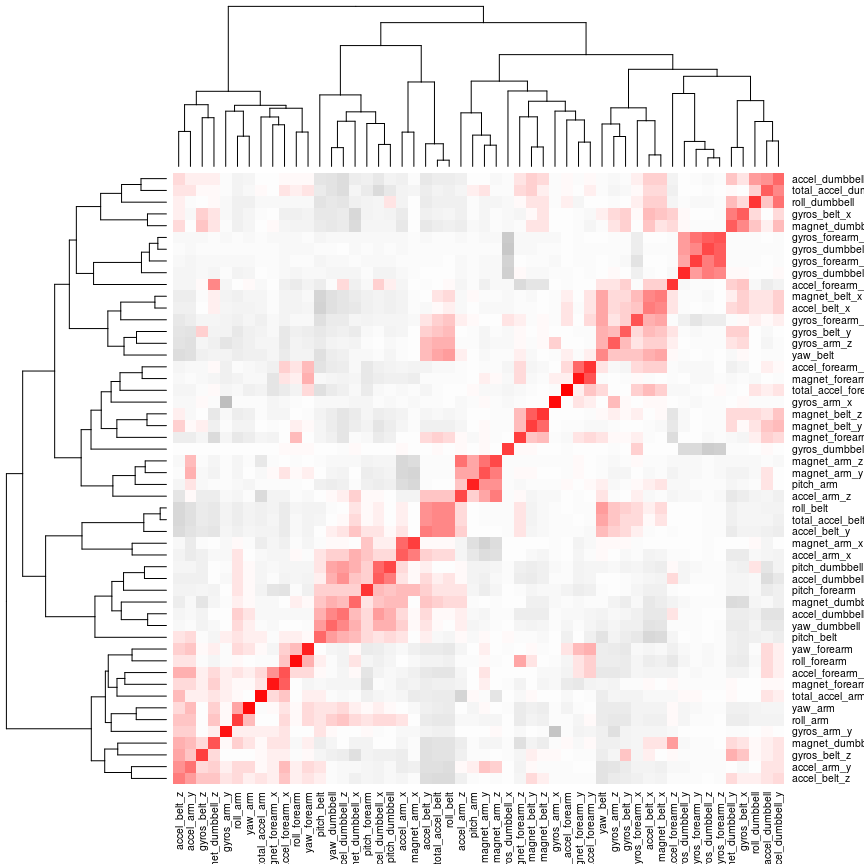
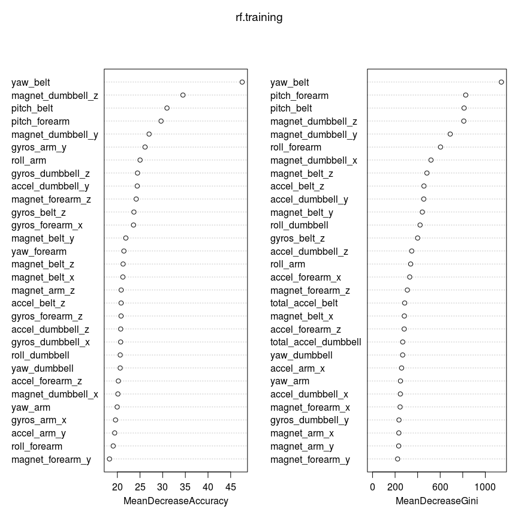

# Predictive model for determining fitness exercise correctness
Antony Mapfumo  
25 April 2015  
<hr>
### Abstract

Using devices such as Jawbone Up, Nike FuelBand, and Fitbit it is now possible to collect a large amount of data about personal activity relatively inexpensively. These type of devices are part of the quantified self movement – a group of enthusiasts who take measurements about themselves regularly to improve their health, to find patterns in their behavior, or because they are tech geeks. One thing that people regularly do is quantify how much of a particular activity they do, but they rarely quantify how well they do it. In this project, I will be to use data from accelerometers on the belt, forearm, arm, and dumbell of 6 participants. They were asked to perform barbell lifts correctly and incorrectly in 5 different ways.
The data for this project come from this source: <http://groupware.les.inf.puc-rio.br/har.Markdown>


### Data preparation, exploration and analyses

```r
library(caret)
```

```
## Loading required package: lattice
## Loading required package: ggplot2
```

```r
library(corrplot)
require(randomForest)
```

```
## Loading required package: randomForest
## randomForest 4.6-10
## Type rfNews() to see new features/changes/bug fixes.
```

```r
setwd("~/practical-machine-learning")
pml.training = read.csv("pml-training.csv", na.strings=c("", "\"\"", "NA"))
pml.testing = read.csv("pml-testing.csv", na.strings=c("", "\"\"", "NA"))
dim(pml.training)
```

```
## [1] 19622   160
```

```r
dim(pml.testing)
```

```
## [1]  20 160
```
I am going to remove the first 7 variables which are X, user_name, raw_timestamp_part_1, raw_timestamp_part_2, cvtd_timestamp, new_window and num_window

```r
pml.training <- pml.training[,-c(1,2,3,4,5,6,7)]
pml.testing <- pml.testing[,-c(1,2,3,4,5,6,7)]
```
Remove all the columns with missing values from the dataset

```r
pml.training <-pml.training[,colSums(is.na(pml.training))==0]
pml.testing <-pml.testing[,colSums(is.na(pml.testing))==0]
```

### Correlation analysis


```r
correlation <- cor(pml.training[, names(pml.training) != "classe"])
pallette <- colorRampPalette(c("grey", "white", "red"))(n = 50)
heatmap(correlation, col = pallette)
```

 
  
| The majority of predictors do not exhibit high level of correlation. There are a few pairs of variables that are highly correlated.     


```r
correlation[(correlation < -0.9 | correlation > 0.9) & correlation != 1]
```

```
##  [1]  0.9809241  0.9248983 -0.9920085 -0.9657334  0.9809241  0.9278069
##  [7] -0.9749317 -0.9657334  0.9248983  0.9278069 -0.9333854 -0.9920085
## [13] -0.9749317 -0.9333854 -0.9181821 -0.9181821 -0.9789507 -0.9144764
## [19] -0.9789507  0.9330422 -0.9144764  0.9330422
```

```r
include.columns <- c("pitch_belt", "yaw_belt", "total_accel_belt", "gyros_belt_x", 
                  "gyros_belt_y", "gyros_belt_z", "accel_belt_x", "accel_belt_y", "accel_belt_z", 
                  "magnet_belt_x", "magnet_belt_y", "magnet_belt_z", "roll_arm", "pitch_arm", 
                  "yaw_arm", "total_accel_arm", "gyros_arm_x", "gyros_arm_y", "gyros_arm_z", 
                  "accel_arm_x", "accel_arm_y", "accel_arm_z", "magnet_arm_x", "magnet_arm_y", 
                  "magnet_arm_z", "roll_dumbbell", "pitch_dumbbell", "yaw_dumbbell", "total_accel_dumbbell", 
                  "gyros_dumbbell_x", "gyros_dumbbell_y", "gyros_dumbbell_z", "accel_dumbbell_x", 
                  "accel_dumbbell_y", "accel_dumbbell_z", "magnet_dumbbell_x", "magnet_dumbbell_y", 
                  "magnet_dumbbell_z", "roll_forearm", "pitch_forearm", "yaw_forearm", "total_accel_forearm", 
                  "gyros_forearm_x", "gyros_forearm_y", "gyros_forearm_z", "accel_forearm_x", 
                  "accel_forearm_y", "accel_forearm_z", "magnet_forearm_x", "magnet_forearm_y", 
                  "magnet_forearm_z")

pml.testing <- pml.testing[, include.columns]
include.columns <- c(include.columns, "classe")
pml.training <- pml.training[, include.columns]
```
Split data to training and testing for cross validation

```r
inTrain <- createDataPartition(y=pml.training$classe, p=0.7, list=FALSE)
training <- pml.training[inTrain,]; 
testing <- pml.training[-inTrain,]
dim(training)
```

```
## [1] 13737    52
```

```r
dim(testing)
```

```
## [1] 5885   52
```

### Modeling
#### Random Forests

```r
set.seed(5)
rf.training=randomForest(classe~.,data=pml.training,ntree=200, importance=TRUE)
varImpPlot(rf.training,)
```

 

```r
rf.training
```

```
## 
## Call:
##  randomForest(formula = classe ~ ., data = pml.training, ntree = 200,      importance = TRUE) 
##                Type of random forest: classification
##                      Number of trees: 200
## No. of variables tried at each split: 7
## 
##         OOB estimate of  error rate: 0.31%
## Confusion matrix:
##      A    B    C    D    E  class.error
## A 5578    2    0    0    0 0.0003584229
## B   11 3785    1    0    0 0.0031603898
## C    0    8 3411    3    0 0.0032144944
## D    0    0   27 3186    3 0.0093283582
## E    0    0    2    3 3602 0.0013861935
```


### Out of sample accuracy
The Random Forest model shows OOB estimate of error rate: 0.31%
Test data evaluation:

```r
tree.pred=predict(rf.training,testing,type="class")
predMatrix = with(testing,table(tree.pred,classe))
sum(diag(predMatrix))/sum(as.vector(predMatrix))
```

```
## [1] 1
```
1 means the model has perfect accuracy (100%).


### Conclusion
The final step is to predict using the given test data.

```r
predictions <- predict(rf.training, pml.testing)
predictions
```

```
##  1  2  3  4  5  6  7  8  9 10 11 12 13 14 15 16 17 18 19 20 
##  B  A  B  A  A  E  D  B  A  A  B  C  B  A  E  E  A  B  B  B 
## Levels: A B C D E
```
I used the random forests algorithm to predict the quality of perfomance of athletes. The model had an accuracy of 100%.
